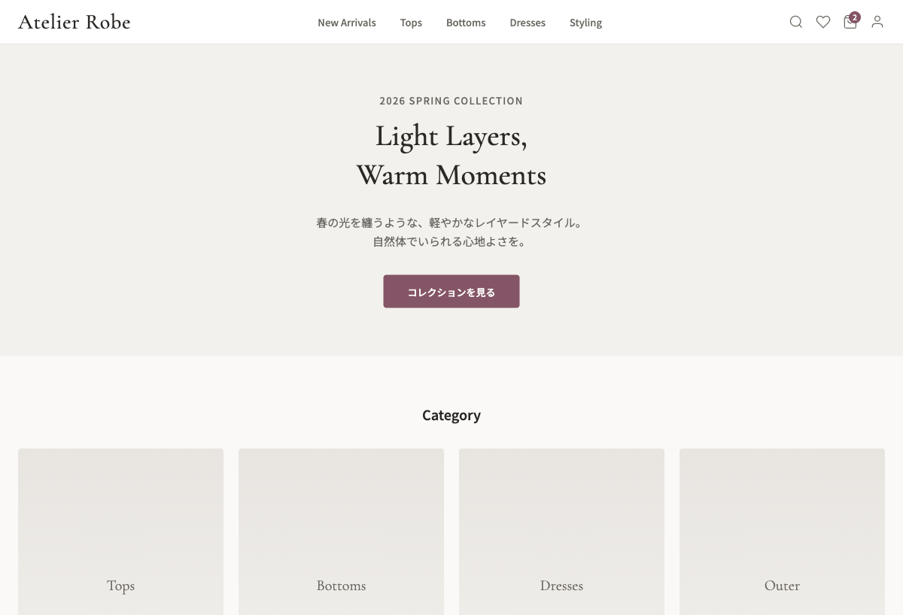
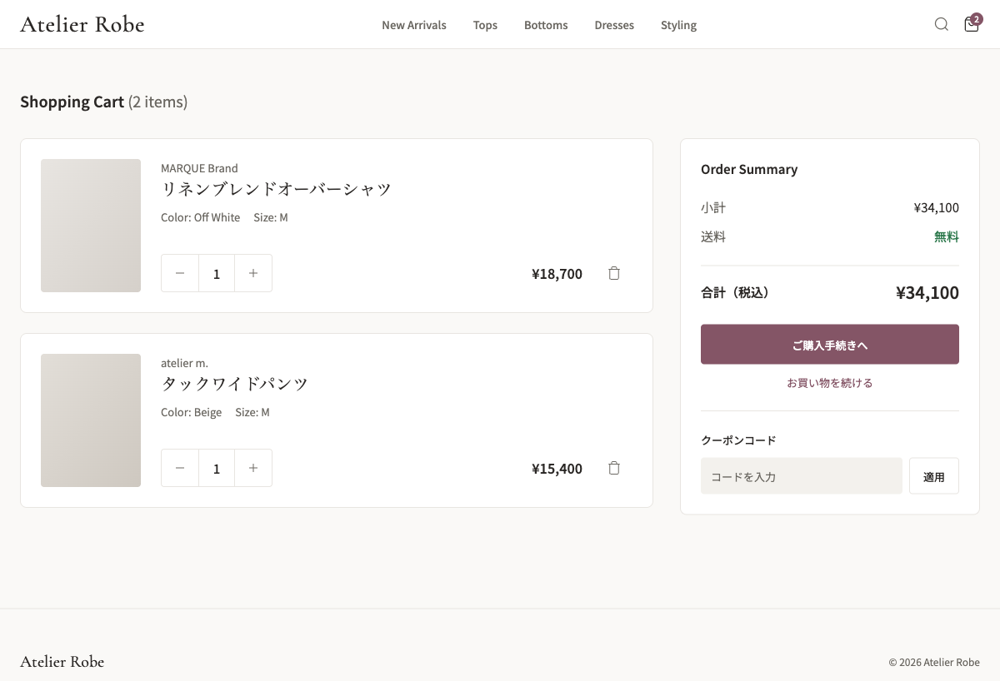
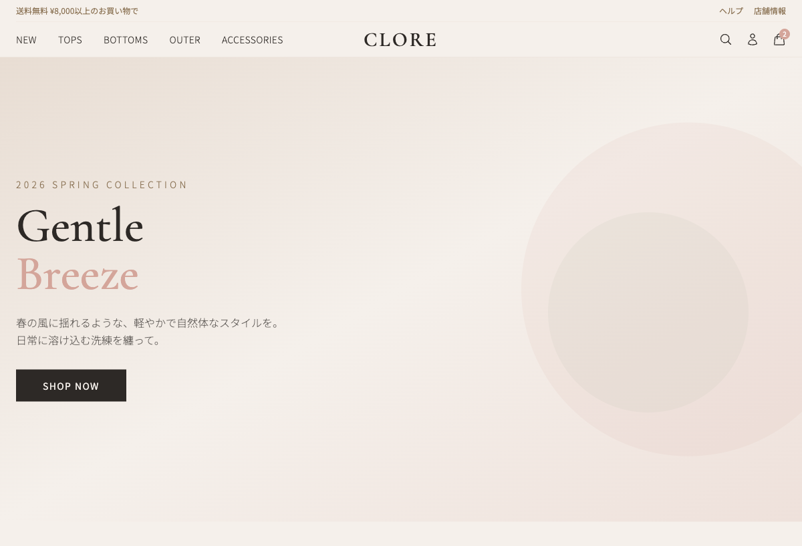
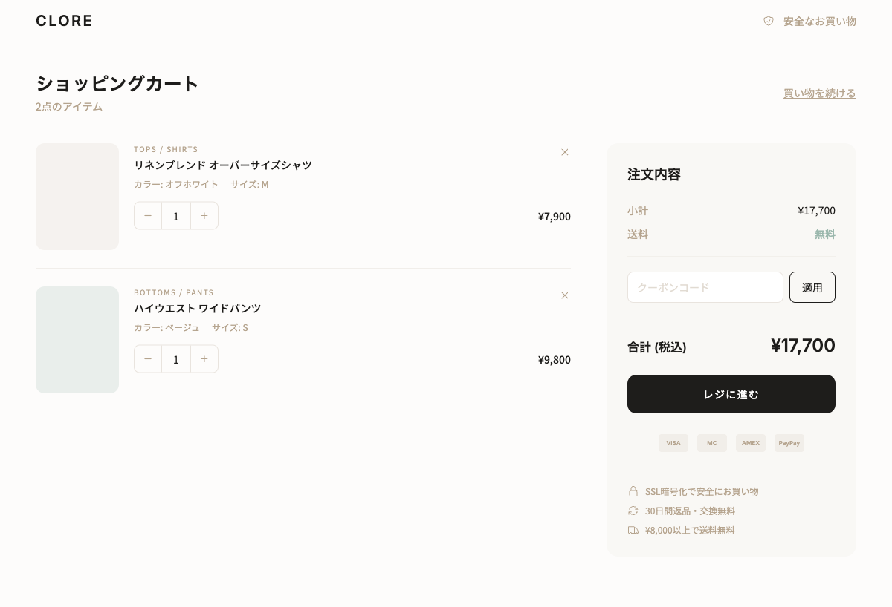

# DESIGN.md Generator

**AIでUIをつくると、画面ごとにデザインがバラバラになりませんか？**

1画面目はいい感じだったのに、2画面目でフォントが変わり、3画面目で色がズレて、修正するほど最初の良さが消えていく——。

DESIGN.md はこの問題を解決します。

あなたのプロダクトの「デザインの判断基準」を1つのファイルにまとめるだけで、AIがつくるUIに統一感が生まれます。すでにあるサービスの世界観やFigmaのデザイン、参考にしているサービスの雰囲気——そういった「すでにあるもの」を出発点にできるので、ゼロから考える必要はありません。デザインの専門知識がなくても、対話に答えていくだけで、あなたのプロダクトに合った DESIGN.md が数分でできあがります。

### DESIGN.md あり / なし の比較

同じ「ファッションEC」を、DESIGN.md **あり** と **なし** でそれぞれ5画面つくった結果です。

**DESIGN.md あり** — 全画面で色・フォント・コンポーネントが統一されている

| トップページ | カート |
|---|---|
|  |  |

**DESIGN.md なし** — 画面ごとにフォント・色味・ヘッダー構造が異なる

| トップページ | カート |
|---|---|
|  |  |

DESIGN.md がない場合、5画面で4種類の見出しフォントと4セットのカラーパレットが混在しました。統一するための手直しに6〜10時間。DESIGN.md をつくるのは数分の対話です。

---

## こんな方に

- **PdM・エンジニア** — AIでプロトタイプを量産しているが、画面を増やすたびにバラバラになる
- **デザイナー** — AIにデザインの意図を伝えたいが、うまく伝わらない
- **デザインに詳しくないエンジニア** — 「なんかいい感じに」で頼んだ結果、毎回違うものが出てくる
- **すでにサービスが動いている方** — 今の世界観を壊さずに、AIにもそのトーンでつくってほしい

デザインの専門知識は必要ありません。わからないことは「わからない」と言えば、AIが補ってくれます。

---

## はじめかた

### Claude Code で使う

Claude Code の画面で、以下の2行を実行するだけです。

```
/plugin marketplace add saladdays/agent-skills
/plugin install design-md@saladdays-skills
```

インストールできたら `/design-md:generate` で DESIGN.md の生成が始まります。

> これは Claude Code の「プラグイン」という仕組みです。1回入れたら、あとはずっと使えます。

### Cursor で使う

Cursor のプラグインマーケットプレイスから `design-md` を検索してインストールしてください。

> [Cursor Marketplace](https://cursor.com/marketplace) に公開後はワンクリックでインストールできます。

### 他のAIツールで使う

DESIGN.md はただの Markdown ファイルなので、どんなAIツールでも使えます。[仕様書](./DESIGN-MD-SPEC.md)と[完成例](#完成例)を渡して「うちのプロダクト用につくって」と伝えるだけです。

---

## つくりかた

AIと対話するだけです。こんなことを聞かれます：

```
AI: どんなサービスですか？ 誰が使いますか？
AI: UIの雰囲気を3つの言葉で表すと？ 参考にしているサービスはありますか？
AI: 既存のサイトやFigmaはありますか？ あれば見てみますね。
AI: 避けたい印象はありますか？
```

既存のサービスURLやFigmaのリンクを渡すと、今のデザインを読み取ったうえで DESIGN.md をつくってくれます。もちろん、まだ何もない状態からでも大丈夫です。

全部答えられなくても大丈夫です。わからないところはAIが良い感じに補ってくれます。5〜10分の対話で DESIGN.md ができあがります。

できあがったら、プロジェクトのいちばん上のフォルダに `DESIGN.md` を置くだけ。CLAUDE.md をお使いなら `@DESIGN.md` の1行を追加しておくと、AIが自動で読んでくれます。

---

## DESIGN.md に何が書いてあるの？

| セクション | ひとことで言うと |
|---|---|
| **TL;DR** | デザインを5行でまとめたもの |
| **Design Principles** | 「うちのサービスらしさ」を言葉にしたもの |
| **Color Strategy** | 使う色と、どう使い分けるかのルール |
| **Typography** | 文字の大きさ・書体・行間の決め方 |
| **Spacing & Layout** | 余白やレイアウトの考え方 |
| **Component Patterns** | ボタンやカードなどの使い分け |

ポイントは、値だけでなく **「なぜその値なのか」「迷ったらどう判断するか」** まで書いてあること。だからAIが新しい画面をつくるときにも、ブレない判断ができます。

---

## 完成例

3種類のプロダクトで DESIGN.md をつくりました。

- [SaaS ダッシュボード](./skills/generate/resources/examples/saas-dashboard.md) — データ中心の管理画面
- [クリエイタープラットフォーム](./skills/generate/resources/examples/creator-platform.md) — 記事や写真を共有するサービス
- [瞑想タイマー](./skills/generate/resources/examples/minimal-zen.md) — とことんシンプルなアプリ

---

## 大切にしていること

- **あなたのプロダクトに合わせる** — テンプレートの押し付けではなく、今あるデザインや世界観を活かしながら、対話のなかでルールを見つけていきます
- **AIの創造性を活かす** — 色やフォントは固定しつつ、自由に工夫していいところも残します
- **完璧じゃなくて大丈夫** — まずつくって、使いながら育てましょう

---

## もっと詳しく

- [DESIGN-MD-SPEC.md](./DESIGN-MD-SPEC.md) — フォーマットの仕様書
- [writing-guide.md](./skills/generate/resources/writing-guide.md) — 良い書き方・良くない書き方の対比

## 背景

[Google Stitch](https://stitch.withgoogle.com/) が2026年3月に発表した [DESIGN.md フォーマット](https://stitch.withgoogle.com/docs/design-md/overview)に着想を得ています。Stitch の「AIが読めるデザインシステム定義」という思想を受け継ぎつつ、特定のツールに依存しない汎用的なフォーマットとして独自に発展させました。Stitch との完全互換ではありませんが、同じ課題意識を持っています。

## License

MIT
